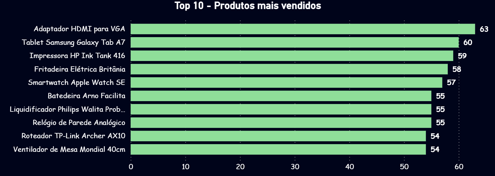
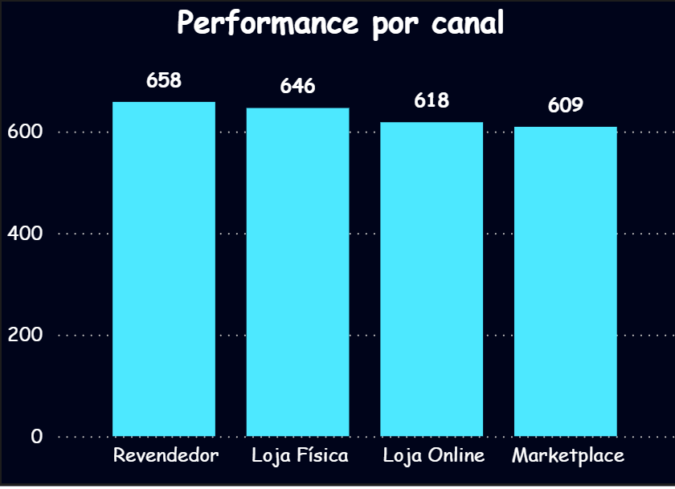
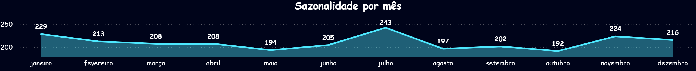
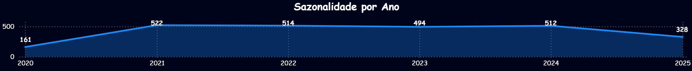

# Desafio Técnico – Analista de Dados | Gerando Falcões

### Análise de Vendas, Clientes e Produtos

Este projeto foi desenvolvido como parte do processo seletivo para a vaga de **Analista de Dados** na organização **Gerando Falcões**. O objetivo principal é estruturar, tratar e analisar os dados de vendas, clientes e produtos, com foco na geração de insights e apoio à tomada de decisão estratégica.

---

## Objetivos

- Tratar e integrar as bases de **clientes**, **vendas** e **produtos**
- Identificar padrões, tendências e responder a perguntas de negócio
- Construir um dashboard interativo com visualizações relevantes
- Tratar produtos com marcas ausentes a partir do nome/descrição

---

## Estrutura do Projeto

### Desafio-GF/ (Repositório)
 * data (Dados brutos originais)

    clientes.csv
    
    produtos.csv
    
    vendas.csv
 * databasetoBI (Dados tratados)
    
    base_unificada.csv

    top_10_produtos.csv

    vendas_por_canal.csv

    vendas_por_mes.csv

 * PBI (Relatorio com informações solicitadas)

    Dashboard_Vendas.pbix    
    
 * src (Arquivos para executar)
    
    1) etl.py
    2) analytcs.py
    
README.md

##  Tecnologias Utilizadas

- **Python**: Pandas, NumPy, Seaborn, Matplotlib
- **Power BI**: Dashboard interativo
- **VScode**
- **Git e GitHub**

---

## Como Executar o Projeto

Para exportar um projeto do GitHub e executá-lo localmente no seu Visual Studio Code (VSCode), siga os passos abaixo:

**1) Clonar o Repositório do GitHub e abrir projeto**

Primeiro, você precisa clonar o repositório do GitHub para o seu computador.

**1.1) Abra o terminal no VSCode:**

* Abra o VSCode.

* Abra o terminal (você pode pressionar Ctrl + (crase) ou ir em Terminal > Novo Terminal).

* Navegue com o comando ````cd```` do CMD (Prompt de comando até a pasta onde deseja exportar o projeto)

* No meu caso eu exportei na pasta documentos Exemplo:
````bash
PS C:\Users\AMD> cd documents
````

**1.2) Clone o repositório no seu diretório local escolhido:**

* No terminal, digite o comando para clonar o repositório:

````bash
git clone <link-do-repositorio>
````
**1.3) Acesse o diretório do projeto:**

* Após clonar o repositório, entre na pasta do projeto:
````bash
cd Desafio-GF
````
**1.4) Abrir a pasta do repositorio/projeto no VSCode:**

copie e cole no terminal o comando abaixo e pressione enter para abrir o projeto:

````bash
code .
````

**1.5) Aberto em nova instancia**

* Foi direcionado a uma nova instancia do VScode, se faz necessario abrir o terminal novamente (você pode pressionar ````Ctrl```` + (crase) ou ir em Terminal > Novo Terminal).

**2) Execução** ````instalar_bibliotecas.py````, ````etl.py```` **e** ````analytcs.py````

* Execute o arquivo ````instalar_bibliotecas.py```` contido na pasta src, copie o código abaixo e cole no terminal e precione enter:

````bash
python instalar_bibliotecas.py
````

* Execute o arquivo ````etl.py```` contido na pasta src, copie o código abaixo e cole no terminal e precione enter:

````bash
python src/etl.py
````

* Execute o arquivo ````analytcs.py```` contido na pasta src, copie o código abaixo e cole no terminal e precione enter:

````bash
python src/analytcs.py
````

**Visões (Quantidade e Faturamento):**

* Top 10 Produtos mais vendidos
* Vendas por Canal
* Sazonalidade por Ano-Mês

**3) Relatório em Power BI**

* Apenas ratificando que o relatório contido no caminho ````Desafio-GF/PBI/Dashboard_Vendas.pbix```` esta com vinculo das bases diretamento do repositório Web. Para que seja atualizado após quaisquer alteração se faz necessario subir os arquivos para o repositório. abrir arquivo com Power BI Desktop.

* Após qualquer alteração no Script carregar novamente o projeto com as bases atualizadas.

Exemplo:
1º comando

````bash
git add .
````

2º comando

````bash
git commit -m "Dados reprocessados devido alteração X"
````

3º comando

````bash
git push -u origin main
````

## Análises Realizadas ##

* Top 10 Produtos Mais Vendidos

* Performance por Canal de Venda

* Análise Temporal e Sazonalidade de Vendas

* Inferência de Marcas Faltantes

* Insights com foco em estratégia de vendas

## Perguntas de Negócio Respondidas ##
1) Quais são os produtos mais vendidos?	

    **Resposta:** Em quantidade o Produto "Adaptador HDMI para VGA" lidera com 63 unidades vendidas.
                  Em faturamento o Produto "Impressora HP Ink Tank 416" lidera com 271.698,00.

````bash 
Top 10 por quantidade:

1ª Adaptador HDMI para VGA
2ª Tablet Samsung Galaxy Tab A7
3ª Impressora HP Ink Tank 416
4ª Fritadeira Elétrica Britânia
5ª Smartwatch Apple Watch SE
6ª Batedeira Arno Facilita
7ª Liquidificador Philips Walita Problend
8ª Relógio de Parede Analógico
9ª Roteador TP-Link Archer AX10
10ª Ventilador de Mesa Mondial 40cm
````

````bash 
Top 10 por Faturamento:

1ª Impressora HP Ink Tank 416
2ª Tablet Samsung Galaxy Tab A7
3ª Adaptador HDMI para VGA
4ª Batedeira Arno Facilita
5ª Cadeira de Escritório Ergonômica
6ª Microfone Fifine K669B
7ª Smartwatch Apple Watch SE
8ª Ventilador de Mesa Mondial 40cm
9ª Mochila Executiva Dell
10ª Roteador TP-Link Archer AX10
````

2) Quais canais performam melhor?

    **Resposta:** Canal "Revendedor" tem maior receita e maio quantidade de vendas, seguido por Canal "Loja Física"

````bash
Por quantidade e faturamento a ordem é a mesma:

1º Revendedor
2º Loja Física
3º Loja Online
4º Marketplace

````

3) Há padrões sazonais nas vendas?

    **Resposta:** Pico de vendas ocorre entre os meses de Janeiro, Julho Setembro e novembro.

    Foi identificado apenas no 2º trimestre uma queda em vendas e faturamento.

4) Produtos com marcas ausentes foram tratados?

    **Resposta:** Sim, com inferência via regex e padrões no nome

## Dashboard (Power BI) ##

**Top 10 Produtos**



**Rank Canais**



**Sazonalidade Mês**



**Sazonalidade Ano**



## Autor ##
**Nome:** Paulo Hiroche Macedo Mizokami

**E-mail:** hiroche.mizokami1@gmail.com

**Linkedin:** [linkedin.com/in/paulo-hiroche-199752248](https://www.linkedin.com/in/paulo-hiroche-199752248/)

**Git Hub:** [github.com/paulomizokami](https://github.com/paulomizokami)
