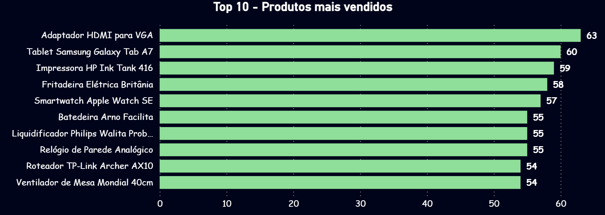
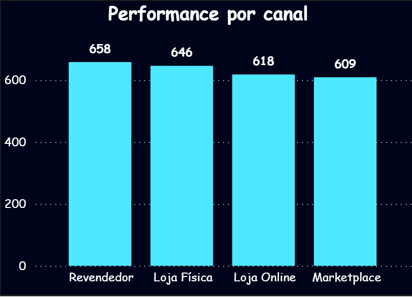
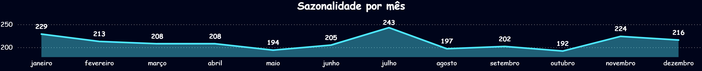

# Desafio Técnico – Analista de Dados | Gerando Falcões

### Análise de Vendas, Clientes e Produtos

Este projeto foi desenvolvido como parte do processo seletivo para a vaga de **Analista de Dados** na organização **Gerando Falcões**. O objetivo principal é estruturar, tratar e analisar os dados de vendas, clientes e produtos, com foco na geração de insights e apoio à tomada de decisão estratégica.

---

## Objetivos

- Tratar e integrar as bases de **clientes**, **vendas** e **produtos**
- Identificar padrões, tendências e responder a perguntas de negócio
- Construir um dashboard interativo com visualizações relevantes
- Tratar produtos com marcas ausentes a partir do nome/descrição

---

## Estrutura do Projeto

### Desafio-GF/ (Repositório)
 * data (Dados brutos originais)

    clientes.csv
    
    produtos.csv
    
    vendas.csv
 * databasetoBI (Dados tratados)
    
    base_unificada.csv

    top_10_produtos.csv

    vendas_por_canal.csv

    vendas_por_mes.csv

 * PBI (Relatorio com informações solicitadas)

    Dashboard_Vendas.pbix    
    
 * src (Arquivos para executar)
    
    1) etl.py
    2) analytcs.py
    
README.md

##  Tecnologias Utilizadas

- **Python**: Pandas, NumPy, Seaborn, Matplotlib
- **Power BI**: Dashboard interativo
- **Jupyter Notebook**
- **Git e GitHub**

---

## Como Executar o Projeto

1. **Clone o repositório:**

```bash
git clone https://github.com/paulomizokami/Desafio-GF.git
```
2. **Navegue até o repositório:**
```bash
cd Desafio-GF
```
3. **Crie um ambiente virtual:**

```bash
python -m venv .venv
source .venv/bin/activate  # Linux/Mac
.venv\Scripts\activate     # Windows
```

5. **Execute o Jupyter Notebook(ou no prompt):**

```bash
jupyter notebook notebooks/01_analise_exploratoria.ipynb
```
(Opcional) Visualize o Dashboard Power BI:
Abra o arquivo visualizations/powerbi_dashboard.pbix com Power BI Desktop.

## Análises Realizadas ##

* Top 10 Produtos Mais Vendidos

* Performance por Canal de Venda

* *Análise Temporal e Sazonalidade de Vendas

* Inferência de Marcas Faltantes

* Insights com foco em estratégia de vendas

## Perguntas de Negócio Respondidas ##
1) Quais são os produtos mais vendidos?	

    **Resposta:** Produto X lidera com Y unidades vendidas
2) Quais canais performam melhor?

    **Resposta:** Canal Z tem maior receita, seguido por Canal Y

3) Há padrões sazonais nas vendas?

    **Resposta:** Pico de vendas ocorre entre os meses de novembro e dezembro

4) Produtos com marcas ausentes foram tratados?

    **Resposta:** Sim, com inferência via regex e padrões no nome

## Dashboard (Power BI) ##
**Visualização Relatório Completo**

**Top 10 Produtos**

**Rank Canais**


**Sazonalidade Mês**


**Sazonalidade Ano**


## Autor ##
**Nome:** Paulo Hiroche Macedo Mizokami

**E-mail:** hiroche.mizokami1@gmail.com

**Linkedin:** [linkedin.com/in/paulo-hiroche-199752248](https://www.linkedin.com/in/paulo-hiroche-199752248/)

**Git Hub:** [github.com/paulomizokami](https://github.com/paulomizokami)
